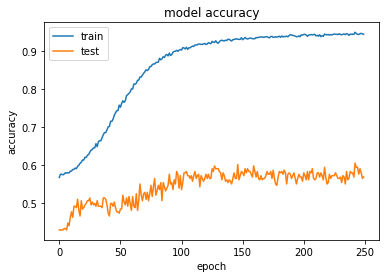
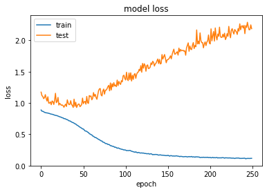

# Skin Burn Detection Using Image Processing

## Overview
This project focuses on detecting skin burn injuries using image processing techniques.
The system analyzes images of burned skin and classifies them based on visual features to assist in preliminary burn assessment.

## Objective
The main objective of this project is to develop an automated approach for identifying skin burn injuries using digital image processing, reducing dependency on manual inspection.

## Dataset
The dataset consists of skin burn images collected for analysis and classification.
These images represent different burn patterns and are used for training and testing the model.
Only sample images are included in this repository.

### Sample Dataset Images
%20-%20Copy%20-%20Copy.jpg)
%20-%20Copy%20-%20Copy.jpg)
%20-%20Copy%20-%20Copy.jpg)

## Tools & Technologies
- Python  
- OpenCV  
- NumPy  
- Matplotlib  

## Methodology
1. Image acquisition  
2. Image preprocessing (resizing, noise removal, enhancement)  
3. Feature extraction using image processing techniques  
4. Classification of burn images based on extracted features  

## Trained Model & Implementation
The core implementation of the burn detection system is contained in the file:

**`GUI_Master_burn.py`**

This file includes:
- Image preprocessing logic
- Feature extraction techniques
- Trained model integration
- Classification logic for detecting skin burn patterns
- A basic graphical user interface to interact with the model

The trained model processes input images and predicts burn characteristics based on learned visual patterns.

## Model Performance
The model performance was evaluated using training accuracy and loss metrics.

### Accuracy
The accuracy graph shows how effectively the model learned patterns from the training data.

### Loss
The loss graph represents the reduction in error during the training process.

